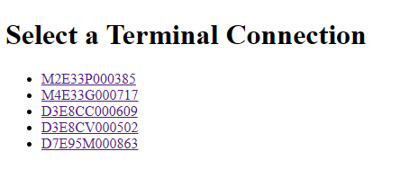
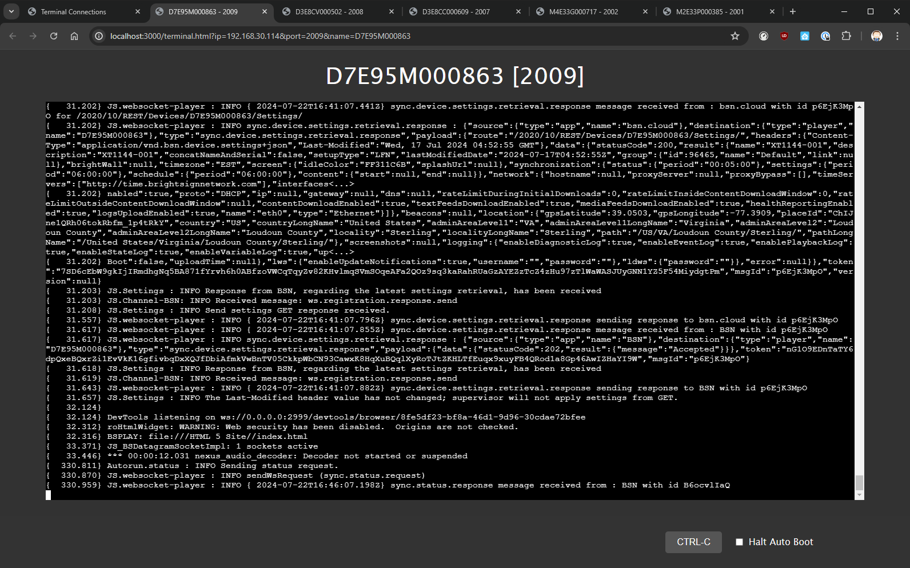

# Description

This app creates a web interface for your serial connections to BrightSign players. A BrightSign player serial connection can be run from a web browser tab, with special features to help in debugging:

- Shortcut button for "CTRL-C"
- Toggle switch for "Halt Auto Boot" which helps enabling the console

# Setup

Connect BrightSign players, via serial, to PC.
Install Node dependencies.
Edit "connections.json" to include the terminal connections to the BrightSign players.
Run server.js. Open browser to http://localhost:3000

# Usage

Added connections will appear on the home page as links. Click link to launch new browser tab.

This is the live serial connection to the player. Interact as you normally would.

- CTRL-C: shortcut button will drop you into the debugger, if script debug has been enabled (registry write brightscript debug 1)
- Halt Autoboot: Enabling this checkbox will halt a player on bootup when the SVC button has been enabled. At the start of a boot cycle, the player will give you 3 seconds to hit CTRL-C to stop the boot and drop to the console prompt. This is enabled by powering the player while holding the SVC button. With this checkbox enabled, this app will detect that message and automatically send CTRL-C. This works for both Series 4 and Series 5 players.

<video controls src="2024-07-22 12-52-06.mp4" title="Title"></video>
